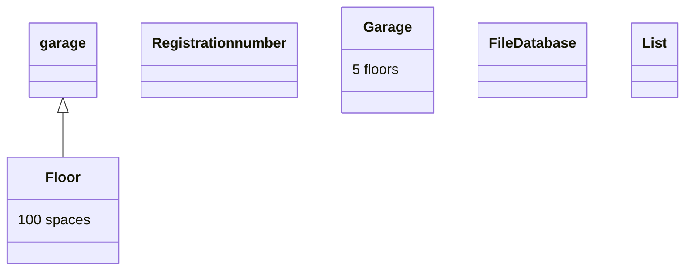

# Design

## Nouns

1. Floor
2. Registration number
3. File / Database
4. List
5. Garage
6. 
7. 
8. 
9. 
10. 

## Verbs

1. List/show each floor and how many free spaces are on each floor. Minimum of five floors. Each floor has 100 spaces.
2. Check in/out a car in the parking garage with a registration number.
3. Save current Registration number to a file or database.
4. Read current Registration number from a file or database.
5. List/show all cars that are currently parked in the parking garage with their registration number.
6. Object oriented design.
7. 
8. 
9. 
10. 

